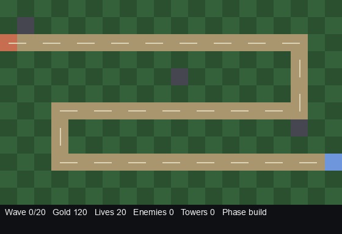

<div align="center">

# AI Gym Tower Defense 🏰

**A tower defense game with a [Gymnasium](https://gymnasium.farama.org/) API for training AI agents.**

Train RL agents, pit heuristic bots against each other, or play by hand — all on the same deterministic engine.

[]()
[]()
[](LICENSE)

[Installation](#installation) • [Quick Start](#quick-start) • [Environment API](#environment-api) • [Training](#training) • [Contributing](#contributing)

</div>

---

## Demo

| PPO Agent (trained 50K steps) | Greedy Baseline |
|:---:|:---:|
|  |  |
| **Wave 7**, 20 lives, reward +7.8 | **Wave 4**, 0 lives, reward -23.4 |

The PPO agent learns to place towers strategically along the enemy path, significantly outperforming the greedy baseline which places towers haphazardly.


## Why?

Tower defense is a surprisingly rich sandbox for AI research:
- **Long horizon**: decisions now affect waves minutes later.
- **Spatial reasoning**: tower placement is a 2-D combinatorial problem.
- **Resource management**: gold, lives, and cooldowns must be balanced.
- **Multi-agent potential**: tournaments between learned agents are one `evaluate.py` away.

This package gives you a **small, fast, pure-Python engine** plus a **Gymnasium wrapper** so you can plug it into Stable-Baselines3, CleanRL, TorchRL, or your own loop.

## Features

- 🎮 **Deterministic engine** — pure Python + NumPy, no GPU required.
- 🧭 **4 tower archetypes** (archer, cannon, ice, tesla) and **4 enemy types** (scout, grunt, brute, swarm).
- 🤖 **Gymnasium env** with spatial grid + global feature observations and action masking.
- 🧠 **Built-in PPO** (CleanRL-style) plus random / greedy / rule-based baselines.
- 🖼️ **Headless PIL renderer** for GIF / MP4 export — great for notebooks and CI.
- 🎨 **Optional pygame viewer** for live play.
- 🔁 **Registered as `TowerDefense-v0`** via `gymnasium.make`.
- 🤖 **LLM agent support** — benchmark OpenAI, Anthropic, and Google models with structured observations.
- 📊 **Benchmark harness** — automated evaluation with win rates, strategic metrics, multi-map support, and cost tracking.

## Installation

```bash
# Minimal install (engine + gym + renderer)
pip install -e .

# With RL training extras
pip install -e ".[rl]"

# With pygame viewer
pip install -e ".[viewer]"

# Everything (rl + viewer + dev tools)
pip install -e ".[all]"
```

## Quick Start

```python
import ai_gym_td
from ai_gym_td.env import TowerDefenseEnv
from ai_gym_td.agents import GreedyAgent

env = TowerDefenseEnv()
agent = GreedyAgent()

obs, info = env.reset(seed=42)
total = 0.0
for _ in range(2000):
    action = agent.act(obs, info)
    obs, reward, terminated, truncated, info = env.step(action)
    total += reward
    if terminated or truncated:
        break
print(f"reward={total:.1f}, wave={info['wave']}, lives={info['lives']}")
```

Or via `gymnasium.make`:

```python
import gymnasium as gym
import ai_gym_td  # registers TowerDefense-v0 on import

env = gym.make("TowerDefense-v0")
obs, info = env.reset()
```

## Environment API

| Item | Shape / Type | Meaning |
|------|--------------|---------|
| **Observation** | `Dict` with `grid`, `global`, `action_mask` | 8-channel `(H, W, 8)` spatial grid + 6-dim global vector + per-action legality mask |
| **Action** | `MultiDiscrete([T+1, H, W])` | `[tower_type, y, x]`. `tower_type=0` = pass; `1..T` = build that tower type. |
| **Reward** | `float` | `+kill -leak ±terminal`, scaled by `RewardConfig`. |
| **Termination** | `bool` | Win (all waves cleared) or loss (lives ≤ 0). |
| **Truncation** | `bool` | Safety cap (`max_env_steps`). |

### Observation channels

| # | Channel | Meaning |
|---|---------|---------|
| 0 | `terrain` | 0=grass, 0.25=path, 0.5=spawn, 0.75=base, 1.0=blocked |
| 1 | `tower_archer` | 1.0 where an archer is built |
| 2 | `tower_cannon` | 1.0 where a cannon is built |
| 3 | `tower_ice` | 1.0 where ice is built |
| 4 | `tower_tesla` | 1.0 where tesla is built |
| 5 | `enemy_density` | Count of enemies in each cell, normalized |
| 6 | `enemy_hp_frac` | Sum of `hp/max_hp` per cell |
| 7 | `path_distance` | Euclidean distance to nearest path cell, normalized |

Global features (length-6 vector): `gold_norm`, `lives_norm`, `wave_norm`, `phase_build`, `phase_wave`, `enemy_count_norm`.

## Training

### PPO

```bash
python -m ai_gym_td.scripts.train \
    --total-timesteps 500_000 \
    --num-steps 256 \
    --lr 2.5e-4 \
    --run-name td_ppo \
    --save-path agent.pt
```

Logs to TensorBoard under `runs/`.

### Evaluate and render

```bash
# Greedy baseline
python -m ai_gym_td.scripts.evaluate --agent greedy --episodes 5

# Rule-based agent, dump a GIF
python -m ai_gym_td.scripts.evaluate --agent rule --episodes 1 --gif greedy.gif

# Your trained agent
python -m ai_gym_td.scripts.evaluate --agent ppo --ckpt agent.pt --episodes 10 --gif ppo.gif
```

### Play manually (requires pygame)

```bash
python -m ai_gym_td.scripts.play
```

Keys `1..4` select tower type, click a grass tile to build, `SPACE` skips the build phase, `ESC` quits.

## LLM Agents & Benchmarking

Benchmark frontier LLMs on strategic tower defense decisions. The framework converts game state into structured text observations and evaluates models on win rate, resource efficiency, and cost.

### Supported Models

| Provider | Models | API Key |
|----------|--------|---------|
| **OpenAI** | `gpt-4o`, `gpt-4o-mini`, `o1-preview`, `o1-mini` | `OPENAI_API_KEY` |
| **Anthropic** | `claude-3-5-sonnet-20241022`, `claude-3-5-haiku-20241022`, `claude-3-opus-20240229` | `ANTHROPIC_API_KEY` |
| **Google** | `gemini-1.5-pro`, `gemini-1.5-flash`, `gemini-2.0-flash-exp` | `GOOGLE_API_KEY` |

### Installation

```bash
# Install LLM provider SDKs
pip install -e ".[llm]"

# Or install all dependencies
pip install -e ".[all]"
```

### Quick Start

```python
from ai_gym_td.env import TowerDefenseEnv
from ai_gym_td.llm_agents import OpenAIAgent

env = TowerDefenseEnv()
agent = OpenAIAgent(model="gpt-4o", env=env)

obs, info = env.reset(seed=42)
for step in range(1000):
    action = agent.act(obs, info)
    obs, reward, terminated, truncated, info = env.step(action)
    if terminated or truncated:
        break

print(f"Survived {info['wave']} waves")
print(f"Agent stats: {agent.get_stats()}")
```

### Running the Benchmark Harness

The benchmark evaluates agents on **strategic planning and resource allocation** in a complex, long-horizon environment.

#### What We Measure

**Performance Metrics:**
- **Win rate** — percentage of games won (all 20 waves cleared)
- **Avg waves survived** — how far the agent got
- **Avg final lives** — remaining base health
- **Avg latency** — API response time per decision
- **Total cost** — USD spent on API calls

**Strategic Metrics:**
- **Tower Efficiency** — damage dealt per gold spent (higher = better ROI)
- **Coverage Score** — % of path cells within tower range (higher = better positioning)
- **Build Timing** — average step when towers are placed (lower = earlier planning)
- **Tower Diversity** — unique tower types used / total available (higher = strategic flexibility)
- **Gold Utilization** — gold spent / total gold available (higher = active resource use)
- **Path Control** — average towers covering each path cell (higher = redundant coverage)

These metrics reveal **how** an agent plays, not just whether it wins. A model that places 3 well-positioned cannons covering 80% of the path beats a model that places 10 archers randomly, even if both lose at wave 10.

#### Available Maps

| Map | Description | Tests |
|-----|-------------|-------|
| `s_curve` | Classic S-shaped path (default) | General strategy |
| `straight` | Simple horizontal path | Baseline performance |
| `zigzag` | Sharp turns and vertical segments | Spatial reasoning |
| `chokepoint` | Narrow sections with open areas | Strategic placement |
| `spiral` | Long winding path | Long-term planning |

#### Running Benchmarks

```bash
# Set API keys
export OPENAI_API_KEY="sk-..."
export ANTHROPIC_API_KEY="sk-ant-..."
export GOOGLE_API_KEY="AI..."

# Run benchmark on baselines (no API key needed)
python scripts/benchmark.py --models greedy random --episodes 5

# Benchmark across multiple maps
python scripts/benchmark.py \
    --models greedy random \
    --maps s_curve straight zigzag chokepoint spiral \
    --episodes 3

# Benchmark frontier models
python scripts/benchmark.py \
    --models gpt-4o claude-3-5-sonnet-20241022 gemini-1.5-pro \
    --maps s_curve zigzag chokepoint \
    --episodes 5 \
    --max-steps 4000

# Results saved to benchmark_results/benchmark_YYYYMMDD_HHMMSS.json
```

#### Example Output

```
================================================================================
BENCHMARK LEADERBOARD
================================================================================

Model                  Win%   Waves   Lives    Gold   Latency     Cost
--------------------------------------------------------------------------------
claude-3-5-sonnet      80.0%    18.2     12.4     145     1.23s $ 0.2847
gpt-4o                 70.0%    17.5     10.8     132     1.45s $ 0.3156
gemini-1.5-pro         60.0%    16.8      9.2     128     0.89s $ 0.1423
greedy                 40.0%    14.3      7.1      98     0.00s $ 0.0000
random                  0.0%     8.2      0.0      42     0.00s $ 0.0000

================================================================================


====================================================================================================
STRATEGIC PERFORMANCE METRICS
====================================================================================================

Model                 Efficiency   Coverage   Timing  Diversity   Util   Control  Towers
----------------------------------------------------------------------------------------------------
claude-3-5-sonnet           1.42     85.2%     12.3     75.0% 78.3%      2.14     8.2
gpt-4o                      1.28     78.5%     15.7     62.5% 72.1%      1.85     7.1
gemini-1.5-pro              1.15     72.3%     18.9     50.0% 68.4%      1.62     6.3
greedy                      0.65     45.8%     25.9     50.0% 92.6%      0.37     2.5
random                      0.00     42.3%     19.6     62.5% 96.3%      0.42     4.0

====================================================================================================
Legend: Efficiency=dmg/gold, Coverage=%path covered, Timing=avg build step,
        Diversity=unique types, Util=gold spent, Control=avg towers/path cell
====================================================================================================
```

### Custom Observations

The `format_obs_for_llm()` function converts the gymnasium observation dict into structured text:

```python
from ai_gym_td.obs_format import format_obs_for_llm

obs, info = env.reset()
text = format_obs_for_llm(env, obs, info)
print(text)
```

This includes:
- **Game State** — gold, lives, wave, phase
- **Grid Map** — ASCII visualization with towers (A/C/I/Z), enemies (E), and terrain
- **Towers** — positions and stats of built towers
- **Enemies** — positions, HP, and speed
- **Legal Actions** — affordable towers and recommended positions

### Adding Your Own Agent

Implement the `Agent` protocol:

```python
from ai_gym_td.agents import Agent
import numpy as np

class MyAgent(Agent):
    def act(self, obs, info) -> np.ndarray:
        # obs["grid"]: (H, W, 8) spatial features
        # obs["global"]: (6,) global state
        # obs["action_mask"]: (5, H, W) legal actions

        # Return [tower_type, y, x] where tower_type=0 is pass
        return np.array([1, 5, 10], dtype=np.int64)
```

See `ai_gym_td/llm_agents.py` for OpenAI/Anthropic/Google implementations.


## Project layout

```
ai-gym-tower-defense/
├── ai_gym_td/
│   ├── __init__.py        # package + gym registration
│   ├── config.py          # TowerSpec, EnemySpec, GameConfig, RewardConfig
│   ├── engine.py          # deterministic simulation
│   ├── pathfinding.py     # A* + distance-to-path helpers
│   ├── env.py             # Gymnasium env
│   ├── render.py          # PIL renderer + GIF/MP4 export
│   ├── viewer.py          # optional pygame viewer
│   ├── agents.py          # random / greedy / rule-based baselines
│   ├── ppo.py             # CleanRL-style PPO
│   ├── llm_agents.py      # OpenAI/Anthropic/Google LLM agents
│   ├── obs_format.py      # structured observation formatting for LLMs
│   ├── gym_register.py    # TowerDefense-v0 registration
│   └── scripts/
│       ├── train.py       # CLI: train PPO
│       ├── evaluate.py    # CLI: eval + GIF
│       └── play.py        # CLI: manual pygame play
├── scripts/
│   └── benchmark.py       # CLI: LLM benchmark harness
├── examples/
│   ├── quickstart.py
│   └── tournament.py
├── benchmark_results/     # JSON benchmark outputs
├── tests/                 # pytest smoke tests
├── pyproject.toml
├── README.md
├── LICENSE
└── .gitignore
```

## Customization

All knobs live in `ai_gym_td/config.py`. Swap the tower roster, change the map, or reshape the reward:

```python
from ai_gym_td import GameConfig
from ai_gym_td.config import TOWERS, RewardConfig

cfg = GameConfig.default_20x12()
cfg = GameConfig(
    width=24, height=14,
    starting_gold=200, starting_lives=30, max_waves=30,
    towers=dict(TOWERS),
    rewards=RewardConfig(kill=2.0, leak=-5.0, win=100.0, lose=-100.0, scale=0.1),
)
```

## Contributing

PRs welcome — see [CONTRIBUTING.md](CONTRIBUTING.md). Roughly:

1. Fork & branch.
2. `pip install -e ".[dev]"`.
3. `ruff check .` and `pytest` before pushing.
4. Open a PR with a clear description and, for gameplay changes, a GIF.

## License

MIT — see [LICENSE](LICENSE).
